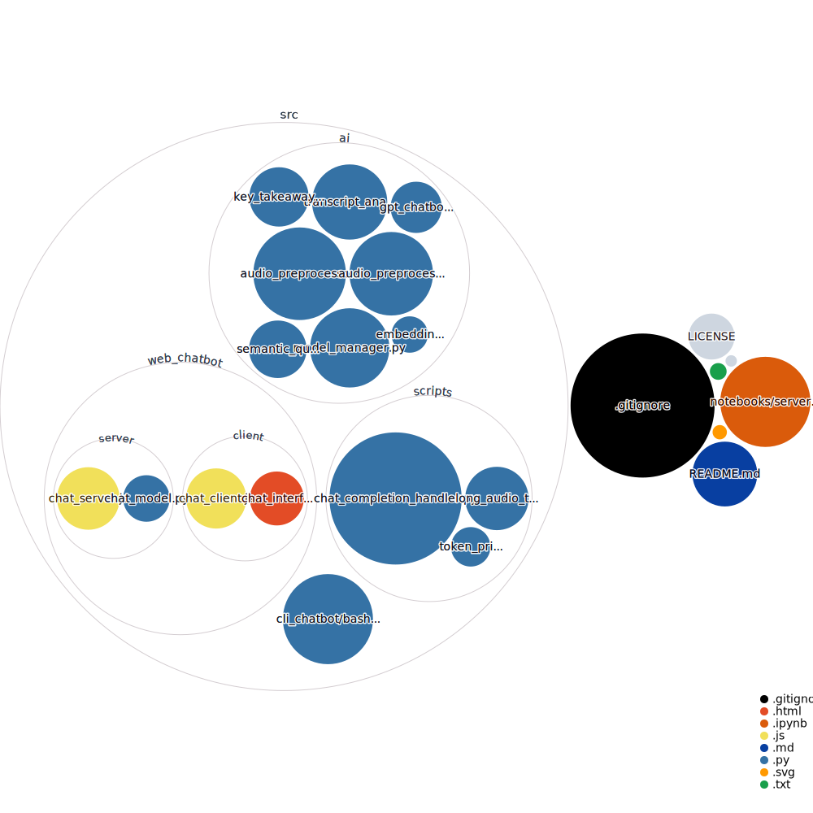

# AI-Conversational-Engine

AI-Conversational-Engine is a sophisticated chatbot framework designed to provide dynamic and intelligent conversational experiences. Leveraging advanced AI models, including GPT-3 for natural language understanding and processing, this engine is equipped to handle a wide range of conversational tasks, from simple Q&A to complex dialogues across various domains.

---

---

## Features

- **GPT-3 Integration**: Utilizes the powerful GPT-3 model for generating human-like responses.
- **Audio Processing Capabilities**: Supports audio inputs for conversations, including speech-to-text processing.
- **Semantic Search**: Enhances conversations with deep semantic search capabilities, allowing for precise answers and context-aware dialogues.
- **Modular Architecture**: Designed with a modular architecture for easy customization and scalability.
- **Client-Server Model**: Includes a ready-to-deploy server and client interface for immediate use and testing.

---

---

## Prerequisites

To operate this project, you will require a `.env` file and a `database` folder. Please note that while the code is open source, these components are not provided.

## Usage

Once the prerequisites have been set up, you can delve into the code snippets and utilize them as per your needs. If you wish to engage with the AI assistant, you can access it via the web interface or the terminal.

## Contributing

You are welcome to fork this repository, create pull requests, or incorporate the code in your own projects. However, I kindly request that you inform me about your intended use of the code.

## Acknowledgements

This project was a joy to develop. We hope you enjoy navigating through it and find it beneficial. Best of luck 😄👍

## License

This project is open-source and is licensed under the [MIT License](LICENSE).
